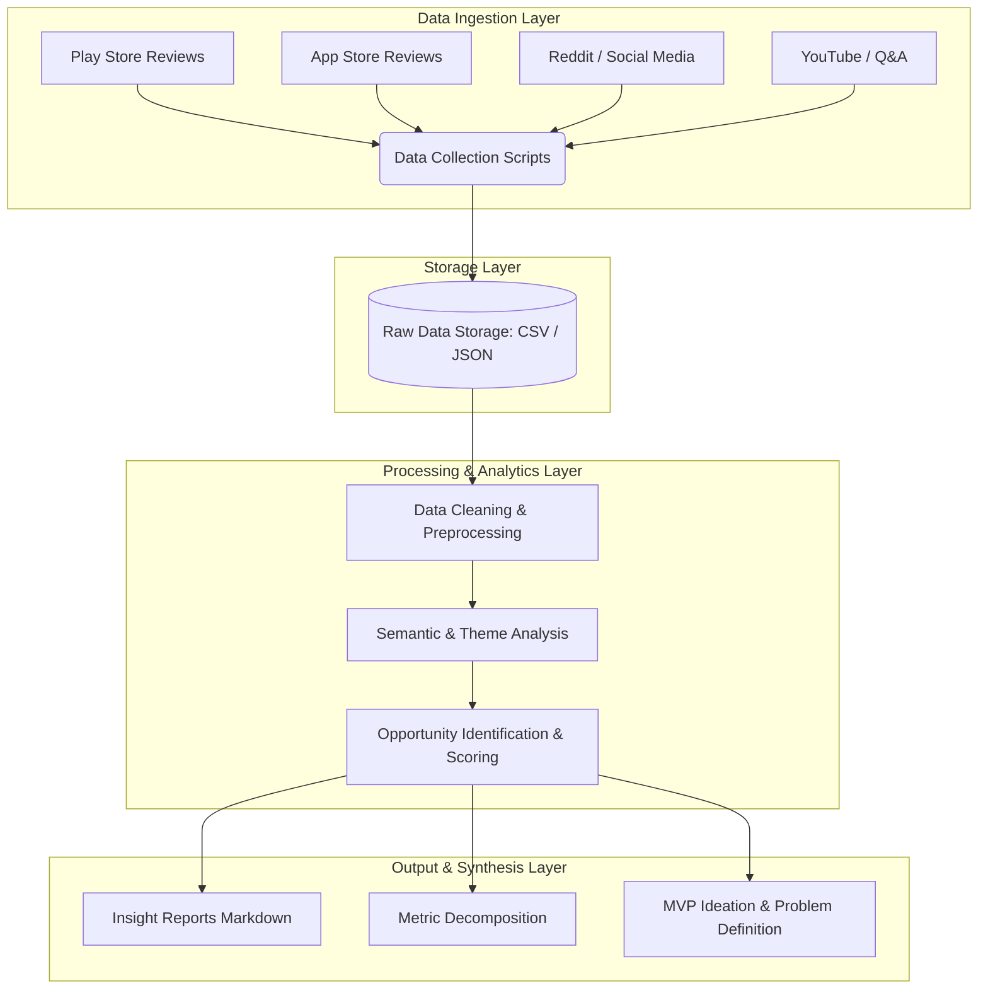

# AI-Powered Discovery Engine: Architecture Document

This document outlines the architecture for the AI-Powered Discovery Engine designed to solve the **Wishlist to Purchase Conversion** problem for AJIO, as defined in `context.md`. The system leverages **Antigravity** (an Agentic AI system) as the core AI-native stack to automate data collection, analysis, and insight generation.

---

## 1. System Overview

The Discovery Engine is an autonomous, agent-driven workflow designed to ingest unstructured user feedback from multiple public sources, process it to extract deep qualitative insights, and synthesize actionable problem definitions.

**Core Objectives of the Architecture:**
- Automate the ingestion of reviews and social discussions.
- Use Large Language Models (via Antigravity) to perform semantic analysis beyond simple sentiment scoring.
- Identify core friction points (e.g., sizing uncertainty, price tracking, intent vs. bookmarking).
- Output quantifiable opportunities to inform the final product MVP.

---

## 2. High-Level Architecture Diagram

---

## 3. Component Breakdown

### A. Data Ingestion Layer
Responsible for gathering raw user conversations and reviews.
- **Play Store & App Store:** Python scripts utilizing `google-play-scraper` and `app-store-scraper` to pull recent reviews of AJIO and competitors.
- **Reddit Discussions:** Python scripts utilizing `praw` (Reddit API) to scrape fashion communities (e.g., r/IndianFashionAddicts) targeting keywords like "wishlist", "cart", "wait for sale", "AJIO", etc.
- **Web Search & Forums:** Antigravity's native `search_web` capabilities to scrape publicly available discussions and Q&A.

### B. Storage Layer
Given the MVP nature of this discovery phase, data will be stored locally in structured formats.
- **Format:** `.csv` and `.json` files.
- **Structure:** `[Timestamp, Source, User ID/Segment, Raw Text, Metadata (Rating, Upvotes)]`
- **Location:** Local workspace directories.

### C. Processing & Analytics Layer (Antigravity AI)
This is the core engine where unstructured data is converted into structured insights.
1. **Data Cleaning:** Scripts to remove spam, irrelevant comments, and normalize text.
2. **Theme Analysis:** Prompting the LLM to categorize feedback into predefined and emergent buckets:
   - *Price Sensitivity* (waiting for sales).
   - *Fit/Size Uncertainty* (unsure about brand sizing).
   - *Bookmarking* (saving for inspiration, no purchase intent).
   - *Social Validation* (waiting to ask friends/family).
3. **Deep Q&A Extraction:** Running the dataset against the specific questions outlined in `context.md` (e.g., "What causes users to postpone a purchase?").

### D. Output & Synthesis Layer
The final layer generates the deliverables required for the presentation and user research phase.
- **Artifact Generation:** Automated creation of markdown files summarizing the top blockers.
- **Metric Decomposition Table:** Breaking down `Wishlist → Purchase Conversion` into leading indicators (e.g., `Time spent on wishlist item page`, `Click-through rate to size charts`).
- **User Segment Profiling:** Identifying the target segment for Part 3 (Primary Research).

## 4. Execution Workflow (Step-by-Step)

1. **Initialize:** Antigravity agent sets up the Python virtual environment and installs necessary scraping libraries.
2. **Scrape:** Agent executes scripts to pull 1000+ reviews/comments across platforms.
3. **Process:** Agent reads the raw data files, chunks the text, and feeds it into its LLM context.
4. **Analyze:** Agent identifies the top 3 reasons for wishlist abandonment and quantifies their frequency.
5. **Synthesize:** Agent outputs an `insights.md` document, which serves as the foundation for the user interviews and the final 10-slide deck.

---

## 5. Security & Constraints
- **Constraint Adherence:** No monetary incentives will be factored into the opportunity analysis. The focus remains strictly on product, UX, and psychological barriers.
- **Data Privacy:** All scraped data is publicly available. PII (Personally Identifiable Information) from user handles will be anonymized or stripped during the Processing Layer.

---

## 6. Next Steps Towards MVP
Once the Discovery Engine identifies the core problem (e.g., "Users abandon wishlists due to lack of styling inspiration"), this architecture will evolve to design the actual MVP (Part 5) which could be an AI styling agent or an in-app social validation feature.

---

## 7. Unified Deployment Architecture (Final Phase)
To keep the live links continuously updated and utilize the free tier efficiently, both the Discovery Engine and the final MVP will be deployed together on Vercel at the very end of the project:
- **Server Infrastructure:** Vercel (Serverless Architecture) hosting both frontends statically and the Flask app(s) as Serverless Functions.
- **Web Server:** `@vercel/python` runtime replacing traditional WSGI servers. It automatically proxies API requests to the Python backends.
- **Static Asset Delivery:** `vercel.json` configured to serve the frontend assets directly via Vercel's global CDN.
- **Secrets Management:** LLM API keys (Groq) securely injected via Vercel Environment Variables.
- **In-Memory Data:** The lightweight `raw_data.csv` is committed alongside the repo and loaded into Pandas on serverless invocation to avoid database costs.
